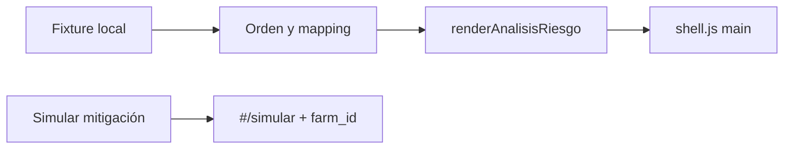

# CAF-102 — Análisis de Riesgo (vista)

Alcance: solo [CAF-102](https://local-viola-3b1.notion.site/CafIA-AgroClimatic-Epics-para-pr-ctica-de-SDD-Jr-Devs-3e78060b98d1811bb070f53a59dc458c). No se implementan CAF-101, CAF-103, CAF-104 ni CAF-105.

El HTML pegado es el mock. Del export se usa únicamente el `<main>`. El `<aside>` y el `<header>` del mock no se copian: la app ya los tiene en [src/components/sidebar.js](src/components/sidebar.js) y [src/components/app-header.js](src/components/app-header.js).

## Fases SDD (las de la guía, en este orden)

1. **Leer la story.** Hecho. Objetivo: explicar el porqué del score con atribución porcentual, y mostrar también lo que juega a favor del productor.
2. **Comparar mock y criterios.** Hecho abajo. Lo que el mock muestra y la spec no define queda anotado; no se inventa comportamiento de descarga ni de API.
3. **Especificar casos borde antes de codear.** Escribir [docs/specs/caf-102-analisis-riesgo.md](docs/specs/caf-102-analisis-riesgo.md) con la resolución de cada caso y el contrato de la fixture. Esa nota es la spec que se implementa.
4. **Construir la vista** solo después de esa nota.
5. **Cerrar contra el DoD** de CAF-102 y el checklist general de la guía (loading/error de red quedan fuera: no hay API en este repo).

## Qué debe cumplir la vista (spec)

- Donut y barra apilada salen de `causal_factors`. Cada segmento muestra `weight_pct`. El color del segmento y del tag sale de `impact_type`, en una sola función.
- El cliente reordena por `weight_pct` descendente. La fixture se guarda desordenada a propósito, para que el orden visible demuestre el DoD.
- Cada card de factor: nombre, tag, `explanation` y `benchmark_comparison`.
- `protective_mechanisms` con datos: sección propia, con el diseño verde del mock (sombra regulada, “Factor Mitigador”). Array vacío: la sección no se renderiza.
- “Simular mitigación y riego” navega a `#/simular` (ruta ya existente) y guarda `{ farmId }` para CAF-103. No se construye el simulador.
- Mapping único:
  - `NEGATIVE_HIGH` → rojo (`error` / `error-container`) → “Impacto alto”
  - `NEGATIVE_MED` → ámbar (`tertiary` / `tertiary-fixed`) → “Impacto moderado”
  - `POSITIVE` → verde (`primary` / `primary-container`) → “Factor protector”
- Porcentajes que no suman 100: se muestran tal cual. La leyenda de la barra usa la suma real, no el texto fijo “100% de la varianza explicada”. `console.warn` si la suma no es 100. No se normaliza.
- `explanation` ausente: “Sin detalle disponible para este factor”.
- `model_version`: `console.info` al pintar. Sin UI propia. La línea “Precisión del modelo: 94.2%” es copia del mock, no sustituye a `model_version`.

## Diferencias mock vs spec (no se inventan)

- El mock pinta cinco colores de segmento (incluye `#a39b8e`, que no está en [src/styles/tailwind.css](src/styles/tailwind.css)). La spec exige color por `impact_type`. Decisión: gana la spec. Dos factores `NEGATIVE_HIGH` comparten rojo; dos `NEGATIVE_MED` comparten ámbar. El donut se genera en SVG (radio 62, perímetro `2πr`) a partir de los pesos ya ordenados, con clases `stroke-*` de los tokens, sin hex sueltos.
- El 65% del centro (“Hídrico + Térmico”) no viene en el contrato. Se calcula como la suma de los `NEGATIVE_HIGH`. La etiqueta queda en la fixture.
- El mock mete el factor protector dentro de la misma grilla. La spec pide una sección distinta. Decisión: las cards negativas van en la grilla; el protector va debajo, con el markup ancho y verde del mock.
- “Descargar informe agrónomo” no está en CAF-102 y no hay archivo ni endpoint. El botón se ve como en el mock y no descarga nada; el click no finge un PDF.
- Hero, foto fenológica, hallazgo crítico y las tres prioridades son contenido del mock, no del contrato `GET /api/v1/farms/{farm_id}/risk-causal-analysis`. Viven en la fixture como presentación, separados de `causal_factors`, `protective_mechanisms` y `model_version`.
- El sidebar del mock (Resumen, Clima, Configuración, “Red Apaneca”) no se porta. Solo se añade un ítem **Riesgos** (`warning_amber`) hacia `#/riesgos` en [src/config/navigation.js](src/config/navigation.js). El resto del menú actual se queda igual.

## Datos

No hay cliente HTTP. [src/data/risk-causal-analysis.js](src/data/risk-causal-analysis.js) exporta la fixture de Finca El Pinar alineada al mock (42, 23, 18, 11 y el mitigador de sombra) más `farmId` (por ejemplo `finca-el-pinar`) y `model_version`. [src/domain/risk-causal.js](src/domain/risk-causal.js) concentra orden, `impactStyle`, fallback de explicación y la suma de pesos.

## Integración

- [src/pages/analisis-riesgo.js](src/pages/analisis-riesgo.js): `renderAnalisisRiesgo()` y `bindAnalisisRiesgo()` (CTA de simulación).
- [src/pages/shell.js](src/pages/shell.js): si la ruta activa es `riesgos`, el `<main>` usa esa vista en lugar de [src/pages/placeholders.js](src/pages/placeholders.js).
- Una fila en [docs/stitch-porting.md](docs/stitch-porting.md): Análisis de Riesgo → `#/riesgos`.

## Preguntas abiertas

Si al confirmar el plan quieres otro default, dímelo. Si no, se implementa así:

- Colores del donut por `impact_type` (spec), aunque el mock use un color distinto por factor.
- El protector va en sección propia, con la tarjeta verde del mock.
- El botón de descarga se muestra y no genera un archivo.
- El botón de simular usa el texto del mock y lleva a `#/simular` con `farmId` en `sessionStorage`.
- Sin estados de red (loading/error): la fuente es la fixture. El caso vacío que sí se prueba es `protective_mechanisms: []` (ocultar la sección); en la spec queda el paso manual para comprobarlo.
